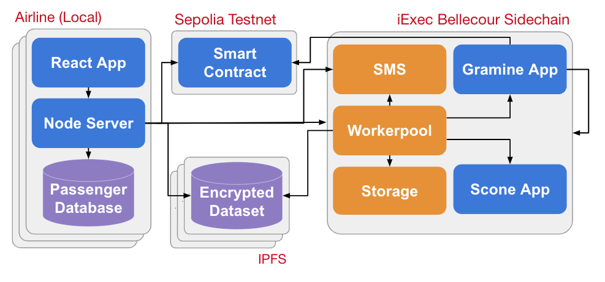

# Internet of Services Lab - Project 5: Privacy-aware Unruly Passenger Identification (TU Berlin SS23)

## About this project

Sharing unruly passenger lists with other airlines entails privacy concerns and competitive risks. We create an interface where airlines can enter the passengers' data to find out if they misbehaved in the past, in a way that the no-fly list owners don't see the data that was entered and the querying airline doesn't see the lists. We do this using a web app connected to the iExec framework, which supports blockchain, decentralized computing, and confidential computation in hardware-based Trusted Execution Environments (TEEs). With our approach, airlines get the added value of shared no-fly lists while preserving the confidentiality of passenger data in the process.

## Repositories

## Architecture

## Setup instructions
